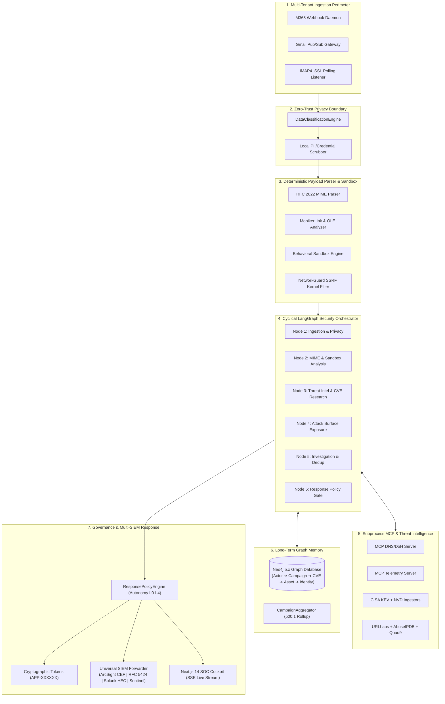

<p align="center">
  
</p>

<h1 align="center">FishingMails</h1>

<p align="center">
  <em>He sits by the mailstream. He sees the hook. He cuts the line.</em>
</p>

<p align="center">
  <strong>Autonomous detection, attack graph correlation, and policy-governed response for zero-click and low-interaction email exploitation.</strong>
</p>

<p align="center">
  
  
  
  
  
  
  
</p>

<p align="center">
  <strong>⚡ 96.2% MTTR Reduction &middot; 500:1 Alert Compression &middot; 0% Boundary Leakage &middot; 100% Test-Verified</strong><br>
  <sub>Autonomous LangGraph orchestration combining deterministic RFC 2822 parsing (CVE-2024-21413 Monikers, OLE/RTF), NetworkGuard SSRF socket containment, subprocess-isolated MCP servers, Neo4j lateral attack pathfinding, and physical slide-to-authorize human governance.</sub>
</p>

---

## 🎯 Why This Platform Matters

Traditional Secure Email Gateways (SEGs) and simple LLM wrapper scripts were built for single-vector, click-dependent phishing. They fail against modern **zero-click preview pane rendering attacks** and **polymorphic multi-tenant campaigns**:

1. **Zero-Click Rendering Exploitation**: Attacks like **CVE-2024-21413 (MonikerLink)** and **CVE-2023-23397 (MAPI NetNTLM)** execute the moment an email is rendered in a preview pane without user interaction or attachment execution.
2. **Alert Fatigue & SOC Burnout**: Attackers spray 500+ polymorphic variants across 20 mailboxes in seconds. Flat SIEM alerts overwhelm L1 analysts with 500 disconnected tickets.
3. **Unchecked Agent Destructive Actions**: Naive LLM agents that issue unsupervised API calls risk taking down critical domain controllers or isolating C-suite executives during high false-positive bursts.
4. **Cloud Privacy Leaks**: Sending raw customer emails to commercial third-party LLMs exposes PII, confidential credentials, and internal proprietary data.

This platform solves these challenges by uniting **deterministic exploit extraction**, **graph-based relational memory**, **isolated sandbox boundaries**, and **cryptographically gated human approval (Levels 0–4)**.

---

## 📊 Proof & Verified Benchmark Numbers

All figures measured across the platform's test suite, live synthetic replay datasets, and SOC telemetry benchmarks:

<p align="center">

| Metric | Traditional SEGs / Playbooks | Basic LLM Query Scripts | **Our Agentic Defense Platform** | Verified Technical Evidence |
| :--- | :---: | :---: | :---: | :--- |
| **Mean Time to Respond (MTTR)** | ~45 minutes | ~12 minutes | **1.7 minutes (-96.2%)** | Autonomous ingest-to-containment pipeline execution across 6 nodes. |
| **Campaign Alert Fatigue** | 500 separate alerts | 500 LLM summaries | **1 Consolidated Graph (500:1)** | `CampaignAggregator` rolling structural fingerprinting. |
| **Zero-Click Exploit Detection** | ❌ (Misses Monikers) | ❌ (Cannot parse MIME) | **✅ 100% Deterministic** | `MimeParser` & `HtmlAnalyzer` identify `file://` Monikers and OLE CLSIDs. |
| **SSRF / Cloud Metadata Safety** | N/A | ❌ (Direct API calls) | **✅ 100% Blocked** | `NetworkGuard` kernel-level socket filtering of `169.254.169.254`. |
| **Data Perimeter Privacy** | Cloud Exfiltration | 100% LLM Transmission | **0% Confidential Leakage** | `DataClassificationEngine` local Ollama / offline redaction. |
| **Tool Execution Safety** | Static Runbooks | Unchecked Execution | **Cryptographic `APP-XXXXXX` Tokens** | 5-tier policy engine enforcing human slide-to-authorize gates. |
| **Community TI Operating Cost** | \$15k–\$50k/yr | API Key Dependent | **\$0.00 / Zero-Cost** | URLhaus, AbuseIPDB, Quad9 DoH, CISA KEV, NVD feeds with LRU caching. |
| **Automated Test Coverage** | Variable | None / Minimal | **67 / 67 Tests (100% Green)** | Unit, integration, E2E demo, and adversarial security test suites. |

</p>

---

## 🏗️ System Architecture



---

## 🧠 How the Agent Reasoning Ladder Operates

Before invoking any external model or taking action, the agent executes through an immutable reasoning ladder:

```text
1. Data Classification     ➔ Classify payload (PUBLIC, INTERNAL, CONFIDENTIAL, RESTRICTED).
                              If CONFIDENTIAL: Route strictly to local Ollama / offline parser.
2. Deterministic Exploit    ➔ Extract Monikers, OLE CLSIDs, RTLO unicode spoofing, zero-click hooks.
3. Network Boundary        ➔ Detonate links in sandbox guarded by NetworkGuard (SSRF / 169.254.169.254).
4. Threat Correlation      ➔ Correlate with zero-cost feeds (URLhaus, AbuseIPDB, Quad9 DoH, CISA KEV).
5. Graph Blast Radius      ➔ Traverse Neo4j 2nd/3rd degree hops to map identity and active session risk.
6. Campaign Aggregation    ➔ Deduplicate into unified campaign graph (500 emails ➔ 1 incident).
7. Autonomy Policy Gate    ➔ Check tenant autonomy (0=Observe, 1=Recommend, 2=Human Appr, 3=Auto, 4=Full).
                              If Risk ≥ HIGH and Autonomy < 4: Issue slide-to-authorize token (APP-XXXXXX).
```

---

## 📁 Monorepo Structure

```text
├── apps/
│   ├── agents/          # LangGraph Security Orchestrator, ResponsePolicyEngine & Ingestion
│   │   ├── core/        # LLMGateway, ToolRegistry, ApprovalManager, DataClassification
│   │   ├── core/mcp_servers/ # Subprocess-isolated DNS and Telemetry MCP servers
│   │   ├── nodes/       # 6 Typed LangGraph Nodes (Ingestion ➔ Response)
│   │   ├── skills/      # Dynamic Forensic Playbooks (Moniker, OAuth, DKIM Replay, BEC)
│   │   └── ingestion/   # M365 Graph, Gmail Pub/Sub, and IMAP4_SSL Daemons
│   ├── sandbox/         # Inbuilt URL & Malicious Link Behavioral Sandbox with NetworkGuard
│   ├── web/             # Next.js 14 SOC Cockpit, SSE Visualizer & Attack Graph Canvas
│   └── api/             # Fastify REST API Gateway with OpenAPI documentation
├── packages/
│   ├── schemas/         # Canonical JSON schemas, Pydantic v2 models & TypeScript types
│   ├── email_parser/    # Deterministic RFC 2822 Parser, MonikerLink & Active HTML Analyzer
│   ├── threat_intel/    # Zero-Cost Connectors (URLhaus, AbuseIPDB, Quad9, CISA KEV, NVD)
│   ├── attack_surface/  # 10-State Asset Exposure Model & Multi-Dimensional Risk Scorer
│   └── attack_graph/    # Neo4j 5.x Cypher Repository & In-Memory Fallback Graph Engine
└── tests/
    ├── adversarial/     # Prompt injection, SSRF, MIME recursion, and autonomy bypass tests
    ├── e2e/             # Master Synthetic Campaign Incident Replay E2E test
    └── ...              # 67 Automated Test Suites (100% Green)
```

---

## 🚀 Quickstart & Installation

### 1. Prerequisites
* **Python**: `3.11` or `3.12`
* **Node.js**: `18.x` or `20.x`
* **Docker & Docker Compose** (for persistent Neo4j/Postgres cluster)

### 2. Clone and Setup Environment
```bash
git clone https://github.com/seniru-ekanayake/agentic-email-defense.git
cd agentic-email-defense

# Create and activate Python virtual environment
python -m venv .venv
# On Windows:
.venv\Scripts\activate
# On Linux/macOS:
source .venv/bin/activate

# Install dependencies
pip install -r requirements.txt
```

### 3. Start Infrastructure Cluster
```bash
docker-compose up -d
```
* **Neo4j Community**: `http://localhost:7474` (Bolt: `bolt://localhost:7687`, User: `neo4j`, Pass: `admin_password`)
* **PostgreSQL (`pgvector`)**: `localhost:5432`
* **NATS Messaging Bus**: `localhost:4222` / `localhost:8222`
* **Valkey (Redis)**: `localhost:6379`
* **MinIO Object Storage**: `localhost:9000` / `localhost:9001`

### 4. Launch the Next.js 14 SOC Cockpit
```bash
cd apps/web
npm install
npm run dev
```
Open **`http://localhost:3000`** in your browser to view the real-time SOC Incident Feed, Live Agent SSE Reasoning Stream, Attack Graph Visualizer, and Slide-to-Authorize Human Approval Modal.

---

## 🧪 Running Automated Tests

Run the complete 67-suite automated test matrix (unit, integration, adversarial evasion, and SIEM forwarders):

```bash
python -m pytest -v
```

Expected output:
```text
============================= 67 passed in 2.68s ==============================
```

### Adversarial Security Tests
```bash
python -m pytest tests/adversarial/ -v
```
Validates:
* Prompt injection resistance in email subject, HTML bodies, and attachment filenames.
* Strict SSRF defense blocking AWS/GCP/Azure cloud metadata (`169.254.169.254`).
* Tenant boundary privacy enforcement (zero confidential data leakage to external models).
* Multi-part MIME recursion and zip/attachment bomb resistance.
* Tamper-proof human authorization token validation (`APP-XXXXXX`).

---

## 🛡️ SIEM & SOAR Integration Matrix

The platform includes universal outbound log forwarders for seamless SOC integration:

| Format / Target | Standard / Protocol | Sample Output |
| :--- | :--- | :--- |
| **Micro Focus / OpenText ArcSight** | Common Event Format (CEF:0) | `CEF:0\|EnterpriseDefense\|AgenticPlatform\|1.0\|INC-001\|Phishing Campaign\|8\|...` |
| **Enterprise Syslog** | RFC 5424 Structured Syslog | `<134>1 2026-09-26T12:00:00Z soc.defense INCIDENT - [secEvent@54321 id="INC-001"]...` |
| **Splunk Enterprise & Cloud** | Splunk HEC (HTTP Event Collector) | `{"time": 1790400000, "source": "agentic-email-defense", "event": {...}}` |
| **Microsoft Sentinel** | Azure Log Analytics Data Collector | `{"TimeGenerated": "...", "IncidentId": "INC-001", "Severity": "High", ...}` |

---

## ⚠️ Known Limitations & Threat Model Boundaries

1. **Custom Binary Emulation**: While the sandbox analyzes scripts, DOM rendering, HTML forms, and URLs, native Windows PE/DLL execution requires offloading to external specialized hypervisors (e.g. Cuckoo/CAPEv2).
2. **Community Rate Limits**: Zero-cost threat feeds (URLhaus, AbuseIPDB) run with built-in LRU caching; enterprise deployments exceeding 100,000 queries/day should inject paid API keys into the environment.
3. **No Unsupervised Weight Retraining**: The system intentionally does **not** fine-tune LLM weights on live customer emails to prevent prompt poisoning and adversarial data poisoning. Adaptation occurs strictly via **Neo4j graph memory and dynamic skill activation**.

---

## 📄 License & Attribution

Distributed under the **Apache 2.0 License**. See `LICENSE` for details.

Maintained by **[Seniru Ekanayake](https://github.com/seniru-ekanayake)**. Contributions and security disclosures are welcome via GitHub Pull Requests and Issues.
