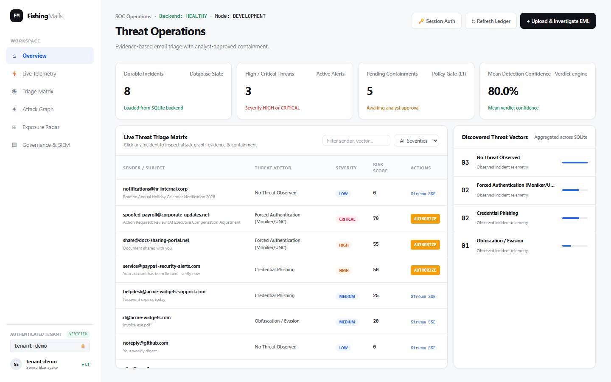

<p align="center">
  
</p>

# FishingMails

Email threat investigation with evidence-backed verdicts and human-approved response.

FishingMails takes a raw `.eml` message and does five things:

1. Parses it (MIME, Authentication-Results, links and URI schemes, Unicode, attachments).
2. Gathers further evidence with a planner-driven set of read-only tools: reputation feeds, an
   SSRF-guarded static link fetch, attachment inspection, DNS, sender history, and a CISA KEV lookup.
3. Scores the message from that evidence. Every point of risk cites the evidence record that produced it.
4. Proposes containment, which an analyst must approve before it is sent to your connectors.

<p align="center">
  
</p>
<p align="center"><em>Web console after investigating the sample emails in <code>tests/fixtures/</code>
(development mode, live reputation lookups).</em></p>

### Verdicts on the bundled sample emails

| Sample | Severity | Risk | Category | Proposed action |
| --- | --- | --- | --- | --- |
| Lunch invite, SPF/DKIM/DMARC pass | LOW | 0 | No Threat Observed | none |
| GitHub notification digest | LOW | 0 | No Threat Observed | none |
| HR holiday notice (`benign-control-73922.eml`) | LOW | 0 | No Threat Observed | none |
| RTLO character in subject | MEDIUM | 20 | Obfuscation / Evasion | none |
| Deceptive link (text ≠ destination), auth pass | MEDIUM | 25 | Credential Phishing | none |
| PayPal look-alike, SPF/DMARC fail + deceptive link | HIGH | 50 | Credential Phishing | quarantine |
| Outlook MonikerLink `file:///\\host\...!` | HIGH | 55 | Forced Authentication, CVE-2024-21413 (in CISA KEV) | quarantine, revoke session |
| `search-ms:` + UNC image, SPF/DMARC fail | CRITICAL | 70 | Forced Authentication | quarantine, revoke session |

Every point of risk is listed in the incident's `risk_provenance` with the ID of the evidence that produced it.

## What it does and doesn't do

| Area | Status |
| --- | --- |
| MIME/header parsing, deceptive links, moniker/UNC links, Unicode obfuscation, attachments | Implemented and tested |
| Evidence-based verdict with full risk provenance | Implemented and tested (labelled corpus; see limitations) |
| Planner: rule-based (default); optional LLM via OpenRouter | Implemented; LLM tested with a scripted provider |
| Reputation: Quad9 threat-blocking DNS, URLhaus (needs `URLHAUS_AUTH_KEY`) | Implemented |
| SSRF-guarded link fetch (literal, DNS and connect-time checks) | Implemented and tested |
| JWT auth, tenant isolation, role-gated single-use approvals | Implemented and tested |
| Containment via webhook connectors you operate | Implemented contract; no vendor-specific integrations |
| SQLite persistence, SSE event replay, Next.js console | Implemented |
| Mailbox ingestion (M365/Gmail/IMAP), SIEM forwarding, Neo4j | Library code only, not wired in |
| Browser/JS detonation, file sandboxing | Not implemented |

Read [docs/LIMITATIONS.md](docs/LIMITATIONS.md) before deploying.

## Quick start (development)

Requires Python 3.11+ (backend: FastAPI, Pydantic 2, SQLite) and Node.js 20.9+ (web console: Next.js 16, React 19, Tailwind CSS).

```bash
python -m venv .venv
source .venv/bin/activate        # Windows: .venv\Scripts\activate
pip install -r requirements-dev.txt
FISHINGMAILS_ENV=development uvicorn apps.server:app --port 8000
```

In development, mint a token for the console:

```bash
curl -s -X POST localhost:8000/api/v1/auth/token -H 'Content-Type: application/json' \
  -d '{"tenant_id":"tenant-dev","roles":["SOC_ANALYST","INCIDENT_RESPONDER"]}'
```

Then start the web console and paste the token under **Session Auth**:

```bash
cd apps/web && npm ci && npm run dev
```

## Production deployment

```bash
cp .env.example .env   # set FISHINGMAILS_ENV=production and both secrets (>= 32 chars)
docker compose up --build -d
```

- The API refuses to start in production without valid `FISHINGMAILS_AUTH_SECRET` and
  `FISHINGMAILS_APPROVAL_HMAC_SECRET`.
- Tokens must be issued by your identity provider: HS256, signed with `FISHINGMAILS_AUTH_SECRET`,
  with `sub`, `tenant_id`, `exp` and `roles` claims. The token endpoint is disabled in production.
- Configure response connectors per [docs/CONNECTORS.md](docs/CONNECTORS.md). Unconfigured
  connectors report `NOT_CONFIGURED`; nothing is reported as done unless the connector returns 2xx.
- Liveness: `GET /healthz`. Readiness (admin): `GET /api/v1/readiness`.
- Data lives in the `fishingmails_data` volume (SQLite). Run a single API instance per database.

## API overview

| Method | Path | Purpose |
| --- | --- | --- |
| POST | `/api/v1/investigate` | Upload an `.eml` (multipart field `file`) and get the incident |
| GET | `/api/v1/incidents`, `/api/v1/incidents/{id}` | List or read incidents in your tenant |
| POST | `/api/v1/incidents/{id}/status` | Set TRIAGED, ESCALATED, CLOSED or FALSE_POSITIVE |
| GET | `/api/v1/investigations/{id}/events` | SSE replay of an investigation's events |
| POST | `/api/v1/approve/{token}`, `/api/v1/reject/{token}` | Act on a containment proposal |
| GET/POST | `/api/v1/planner-settings` | Planner mode and arbitration policy (POST: admin) |
| GET | `/api/v1/integrations`, `/api/v1/audit-logs` | Integration status; tenant audit log |

Interactive docs: `http://localhost:8000/docs`.

Incident status moves from `CLOSED` (benign), `TRIAGED` (suspicious) or `CONTAINMENT_PROPOSED` to
`CONTAINED` once every proposal has been acted on and at least one was confirmed by a connector.
Proposals that were approved, rejected or failed to dispatch are kept in `resolved_approvals`.

## Tests

```bash
pytest -m "not network"
```

The suite (263 tests, about 15 seconds) runs offline: only loopback connections are allowed. It covers:

- verdict correctness on a 15-message labelled corpus
- authentication and tenant isolation
- approval semantics, including dispatch to a real local connector
- SSRF
- LLM planner failure modes
- persistence and SSE

`pytest -m network` runs the one test that needs internet access (live DNS).

## Documentation

- [Architecture](docs/ARCHITECTURE.md)
- [Security model](docs/SECURITY_MODEL.md)
- [Connector contract](docs/CONNECTORS.md)
- [Limitations](docs/LIMITATIONS.md)
