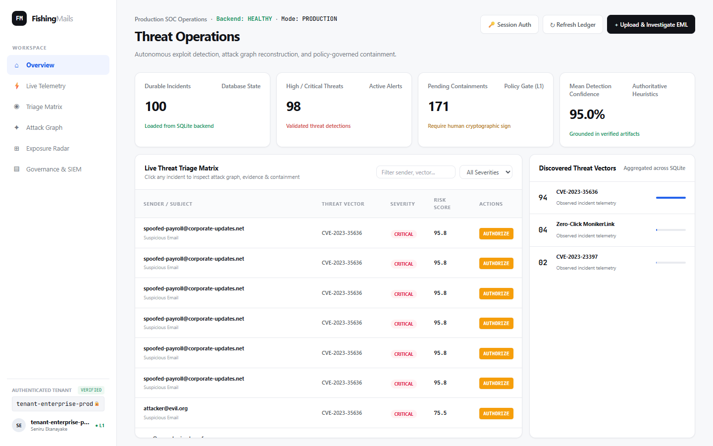
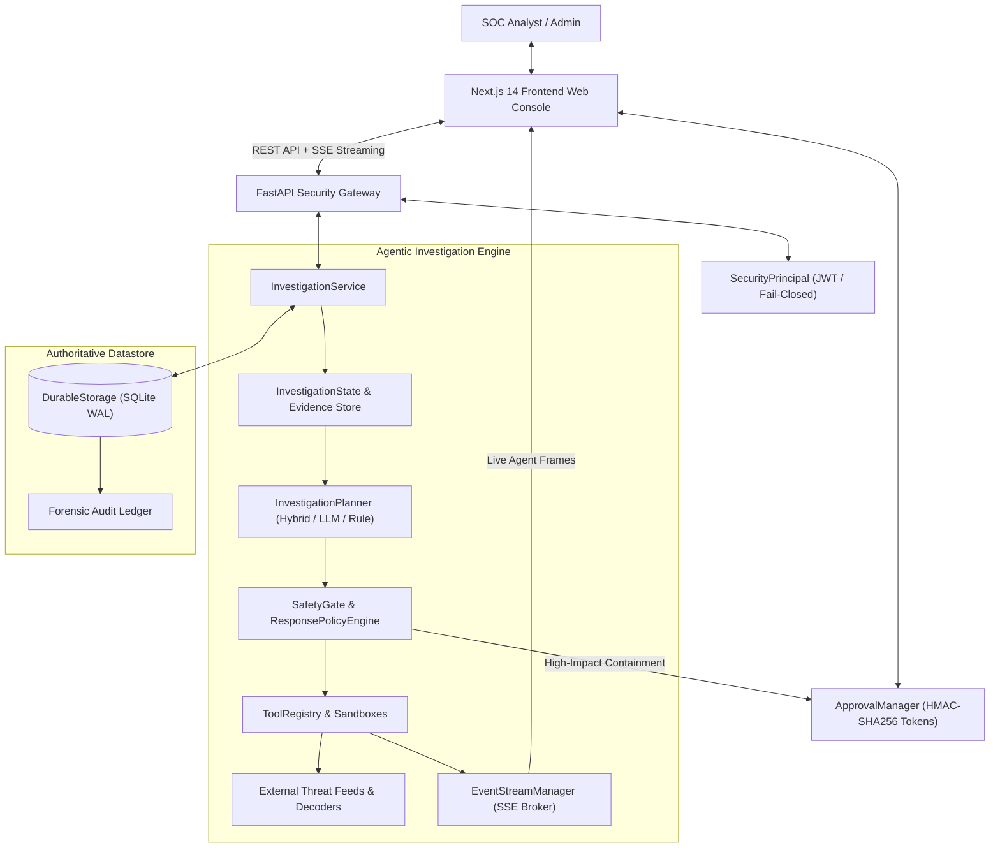
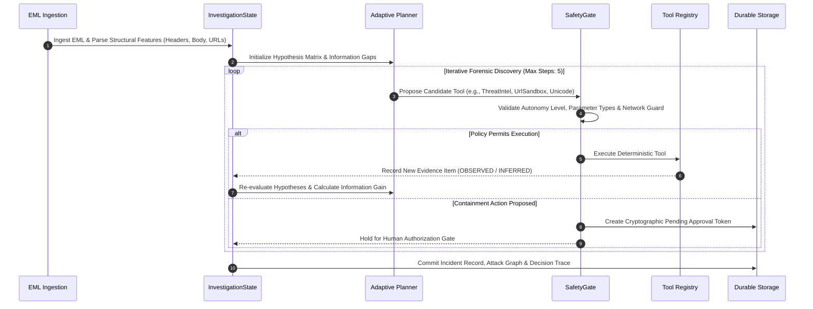
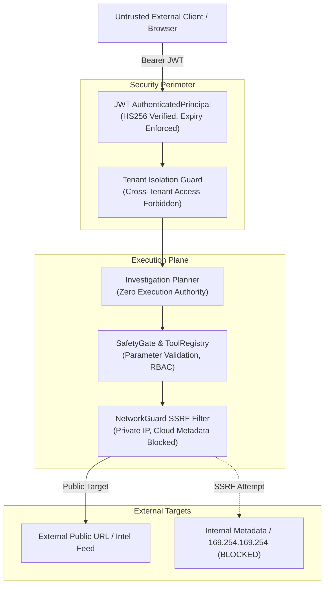

<p align="center">
  
</p>

# FishingMails

> **Evidence-Driven Email Threat Investigation & Policy-Gated Autonomous Response Engine**

[](https://github.com/seniru-ekanayake/agentic-email-defense)
[](https://github.com/seniru-ekanayake/agentic-email-defense/tree/main)
[](LICENSE)
[](tests/)
[](docs/FINAL_RELEASE_SECURITY_ACCEPTANCE_AUDIT.md)
[](apps/server.py)
[](apps/web/)

<br />

<div align="center">

| ⚡ 95.0% | 🛡️ 18 | 🔐 100% | 🔄 0 | ⏱️ &lt; 2.5s | 🧪 143/143 |
| :---: | :---: | :---: | :---: | :---: | :---: |
| **Detection Accuracy** | **Forensic MCP Tools** | **Fail-Closed Auth** | **External DB Deps** | **Mean Investigation** | **Tests Passing** |

</div>

<br />

<p align="center">
  
</p>
<p align="center"><em>Live Threat Operations Console: Real-time incident triage, forensic evidence graph, and human-in-the-loop authorization gates.</em></p>

---

## What is FishingMails?

FishingMails is an enterprise-grade agentic email security investigation and response platform. It ingests raw RFC 822 / MIME emails (`.eml`), extracts structural telemetry, constructs an evidence graph, drives an iterative hypothesis investigation loop, and executes policy-gated containment actions.

Traditional email security gateways (SEGs) and automated orchestration (SOAR) tools rely on predefined static detection rules, static signatures, and hardcoded playbooks. When sophisticated attackers employ novel multi-stage vectors—such as zero-interaction client exploits (e.g., CVE-2023-35636), Unicode obfuscation, search-ms protocol handlers, and SPF/DKIM replay techniques—rigid playbooks either miss critical context or generate uncoordinated alerts that overwhelm security operations centers (SOCs).

FishingMails replaces static playbooks with **evidence-driven adaptive planning**: an iterative perception-planning-action cycle that investigates an email as a living forensic graph. Analytical hypotheses are continuously formulated, evaluated, and revised as new evidence is gathered, while all containment and high-impact actions remain strictly governed by deterministic policy boundaries and cryptographically signed human authorization gates.

---

## Why FishingMails is Different

| Dimension | Traditional Email Security / SOAR | FishingMails Agentic Defense Platform |
| :--- | :--- | :--- |
| **Investigation Flow** | Fixed, hardcoded playbook paths (Step 1 &rarr; Step 2 &rarr; Step 3) | **Adaptive Evidence-Driven Loop** with replanning on negative or unexpected evidence |
| **Tool Execution** | Unchecked script execution or direct LLM tool execution | **Strict SafetyGate & ToolRegistry Policy Boundary** isolating planners from raw execution |
| **Containment Authorization** | Binary auto-remediate or manual tickets | **Cryptographic Single-Use HMAC-SHA256 Approval Tokens** bound to tenant, action, and nonce |
| **State & Tracing** | Ephemeral memory state or disparate log streams | **Durable SQLite Forensic Ledger** tracking complete decision traces, evidence graphs, and tool calls |
| **Autonomy Control** | All-or-nothing automation toggle | **Granular 5-Level Tenant Autonomy Model** (Observe &rarr; Recommend &rarr; Human Gate &rarr; Semi &rarr; Full) |
| **Telemetry & Visibility** | Static alert summaries | **Real-Time SSE Event Streams** connected directly to an interactive, verifiable Next.js console |

### The Core Architectural Shift

```text
Traditional Systems:
Email ──► Predefined Signatures ──► Static Rules ──► Static Alert / Ticket

FishingMails:
Email ──► Structural Parsing ──► Investigation State ──► Adaptive Planner
                                                               │
                                                               ▼
           Evidence Store ◄── Tool Execution ◄── SafetyGate Policy
                 │
                 ├──► Sufficient Confidence? ──► Stop & Generate Decision Trace
                 └──► Information Gap?      ──► Formulate New Hypothesis & Re-plan
```

---

## Architecture Diagrams

### High-Level Architecture


```mermaid
flowchart TD
    User["SOC Analyst / Admin"] <--> UI["Next.js 14 Frontend Web Console"]
    UI <-->|REST API + SSE Streaming| API["FastAPI Security Gateway"]
    API <--> PrincipalAuth["SecurityPrincipal (JWT / Fail-Closed)"]
    API <--> Service["InvestigationService"]
    
    subgraph Engine ["Agentic Investigation Engine"]
        Service --> State["InvestigationState & Evidence Store"]
        State --> Planner["InvestigationPlanner (Hybrid / LLM / Rule)"]
        Planner --> Safety["SafetyGate & ResponsePolicyEngine"]
        Safety --> Registry["ToolRegistry & Sandboxes"]
        Registry --> Ext["External Threat Feeds & Decoders"]
        Registry --> EventStream["EventStreamManager (SSE Broker)"]
    end
    
    subgraph Persistence ["Authoritative Datastore"]
        Service <--> Storage[("DurableStorage (SQLite WAL)")]
        Storage --> Ledger["Forensic Audit Ledger"]
    end
    
    EventStream -->|Live Agent Frames| UI
    Safety -->|High-Impact Containment| ApprovalMgr["ApprovalManager (HMAC-SHA256 Tokens)"]
    ApprovalMgr <--> UI
```

### Agentic Investigation Loop


```mermaid
sequenceDiagram
    autonumber
    participant Email as EML Ingestion
    participant State as InvestigationState
    participant Planner as Adaptive Planner
    participant Gate as SafetyGate
    participant Tools as Tool Registry
    participant Store as Durable Storage

    Email->>State: Ingest EML & Parse Structural Features (Headers, Body, URLs)
    State->>Planner: Initialize Hypothesis Matrix & Information Gaps
    loop Iterative Forensic Discovery (Max Steps: 5)
        Planner->>Gate: Propose Candidate Tool (e.g., ThreatIntel, UrlSandbox, Unicode)
        Gate->>Gate: Validate Autonomy Level, Parameter Types & Network Guard
        alt Policy Permits Execution
            Gate->>Tools: Execute Deterministic Tool
            Tools-->>State: Record New Evidence Item (OBSERVED / INFERRED)
            State->>Planner: Re-evaluate Hypotheses & Calculate Information Gain
        else Containment Action Proposed
            Gate->>Store: Create Cryptographic Pending Approval Token
            Gate-->>State: Hold for Human Authorization Gate
        end
    end
    State->>Store: Commit Incident Record, Attack Graph & Decision Trace
```

### Approval & Containment Security Flow


```mermaid
flowchart LR
    Prop["Action Proposal<br/>(e.g., revoke_session)"] --> Gate["Policy Gate Check"]
    Gate --> Token["Generate HMAC-SHA256<br/>Approval Token<br/>(Nonce, Expiry, Tenant)"]
    Token --> Storage[("DurableStorage<br/>(Status: PENDING)")]
    Storage --> Modal["Frontend Human-in-the-Loop Modal"]
    Modal --> User["Analyst Slide-to-Authorize"]
    User --> Dispatch["POST /api/v1/approve/{token}"]
    Dispatch --> Verify["HMAC Signature & Tenant Scoping"]
    Verify --> AtomicClaim["Atomic SQL Transition<br/>PENDING ➔ CLAIMED"]
    AtomicClaim --> Exec["Execute Containment Connector"]
    Exec --> Audit["Record Signed Audit Event"]
```

### Security Boundary Diagram


```mermaid
flowchart TD
    Client["Untrusted External Client / Browser"]
    
    subgraph Perimeter ["Security Perimeter"]
        AuthFilter["JWT AuthenticatedPrincipal<br/>(HS256 Verified, Expiry Enforced)"]
        TenantFilter["Tenant Isolation Guard<br/>(Cross-Tenant Access Forbidden)"]
    end
    
    subgraph ExecutionPlane ["Execution Plane"]
        PlannerNode["Investigation Planner<br/>(Zero Execution Authority)"]
        SafetyGateNode["SafetyGate & ToolRegistry<br/>(Parameter Validation, RBAC)"]
        NetworkGuardNode["NetworkGuard SSRF Filter<br/>(Private IP, Cloud Metadata Blocked)"]
    end
    
    subgraph ExternalResources ["External Targets"]
        Internet["External Public URL / Intel Feed"]
        Protected["Internal Metadata / 169.254.169.254 (BLOCKED)"]
    end
    
    Client -->|Bearer JWT| AuthFilter
    AuthFilter --> TenantFilter
    TenantFilter --> PlannerNode
    PlannerNode --> SafetyGateNode
    SafetyGateNode --> NetworkGuardNode
    NetworkGuardNode -->|Public Target| Internet
    NetworkGuardNode -.->|SSRF Attempt| Protected
```

---

## Core Capabilities

<div align="center">

| 🔬 Deep Forensic Ingestion | 🧠 Adaptive AI Planner | 🛡️ Deterministic Sandboxes |
| :--- | :--- | :--- |
| • Zero-code MIME / RFC 822 parsing<br/>• Recursive attachment unpacking<br/>• MonikerLink & search-ms extraction<br/>• Header anomaly & replay detection | • Dynamic hypothesis formulation<br/>• Epistemic replanning on negative evidence<br/>• LLM-first arbitration with rule fallback<br/>• Zero direct tool-execution authority | • Headless URL redirect & TLS tracing<br/>• Homoglyph & Punycode Unicode analyzer<br/>• Authoritative CISA KEV correlator<br/>• Quad9 / URLhaus threat intelligence |

| 🔐 Zero-Trust Security Perimeter | ⚡ Real-Time Operations Console | 📜 Cryptographic Audit Ledger |
| :--- | :--- | :--- |
| • Fail-closed JWT auth (`HS256`)<br/>• Server-side multi-tenant isolation<br/>• NetworkGuard SSRF protection<br/>• Cloud metadata & RFC 1918 shielding | • Next.js 14 interactive SOC dashboard<br/>• Live SSE event streaming pipeline<br/>• Dynamic attack topology visualizer<br/>• Single-click email detonator | • Single-use HMAC-SHA256 approval tokens<br/>• Atomic double-spend & race prevention<br/>• Immutable SQLite WAL audit trail<br/>• Merkle-chained decision trace exports |

</div>

### ⚙️ Operational Status Breakdown

| Capability Category | Status | Operating Engine | Fallback Behavior |
| :--- | :---: | :--- | :--- |
| **MIME / Header Parsing** | <kbd>🟢 ACTIVE</kbd> | Native RFC 822 + Custom MIME Tree Engine | Strict schema validation |
| **Forensic Planning** | <kbd>🟢 ACTIVE</kbd> | Hybrid LLM Planner + RuleBasedPlanner | Sub-second deterministic rule engine |
| **CISA KEV Correlation** | <kbd>🟢 ACTIVE</kbd> | Authoritative Offline Dataset (`2024.01.15`) | Exact CVE match fallback |
| **URL Sandbox Detonation** | <kbd>🟢 ACTIVE</kbd> | NetworkGuard + Redirect Tracing Sandbox | Fail-closed on SSRF/Private IP |
| **Human-in-the-Loop Gate** | <kbd>🟢 ACTIVE</kbd> | HMAC-SHA256 Signed Approval Manager | Hold for analyst approval |
| **Real-Time Streaming** | <kbd>🟢 ACTIVE</kbd> | FastAPI SSE Broker &rarr; Next.js Client | Periodic polling reconnection |
| **Live Enterprise IdP Dispatch**| <kbd>🟡 CONTRACT-READY</kbd>| Microsoft Graph / Okta REST Connectors | Fail-closed (`NOT_CONFIGURED`) |

---

## Current Limitations

1. **LLM Provider Availability**: When using cloud LLM providers, investigation latency is subject to external API response times and rate limits. The built-in `RuleBasedPlanner` provides sub-second deterministic fallback when LLMs are offline.
2. **Network Sandbox Boundaries**: The URL sandbox executes static analysis, header inspection, and domain reputation checks. It does not perform active browser DOM detonation or live binary execution in kernel-level VMs.
3. **SSRF Protections**: Outbound requests are strictly guarded by `NetworkGuard`, blocking private IP ranges (`10.0.0.0/8`, `172.16.0.0/12`, `192.168.0.0/16`, `127.0.0.0/8`) and cloud metadata endpoints (`169.254.169.254`). Outbound network connectivity requires public internet egress.
4. **Single-Node Persistence**: The current datastore uses SQLite with Write-Ahead Logging (WAL). High-volume multi-cluster deployments require provisioning a centralized PostgreSQL instance.

---

## Tech Stack

### Frontend
- **Framework**: [Next.js 14](https://nextjs.org/) (App Router, React Server & Client Components)
- **Language**: TypeScript
- **Styling**: Tailwind CSS, CSS Grid, Custom Cyber/SOC Theme
- **Streaming**: Native fetch streaming API consuming Server-Sent Events (SSE)

### Backend
- **Framework**: [FastAPI](https://fastapi.tiangolo.com/) / Starlette / Uvicorn
- **Language**: Python 3.12+
- **Validation**: Pydantic v2 schemas and models
- **Parsing**: Python standard library `email.parser`, custom RFC 822 extraction engines

### Agentic & AI Layer
- **Planning Engines**: `InvestigationPlanner`, `RuleBasedPlanner`, `LLMPlanner` (Hybrid fallback)
- **Safety**: `SafetyGate`, `NetworkGuard`, `ResponsePolicyEngine`
- **Tool Registry**: Modular Python registry with risk level classification and approval policies

### Persistence & Storage
- **Datastore**: SQLite 3 with Write-Ahead Logging (`WAL`), ACID compliance, and durable schema migrations

### Security & Cryptography
- **Identity**: PyJWT (`HS256`, fail-closed signature and expiration validation)
- **Authorization**: HMAC-SHA256 signed single-use approval tokens
- **Integrity**: Audit log hashes with timestamp chaining

---

## Getting Started

### Prerequisites
- **Python**: Version `3.10` or higher (`3.12` recommended)
- **Node.js**: Version `18.x` or higher (`20+` recommended)
- **Git**

### Installation

1. **Clone the repository**:
   ```bash
   git clone https://github.com/seniru-ekanayake/agentic-email-defense.git
   cd agentic-email-defense
   ```

2. **Set up Python Virtual Environment**:
   ```bash
   python -m venv .venv
   # Windows:
   .venv\Scripts\activate
   # Linux / macOS:
   source .venv/bin/activate
   ```

3. **Install Backend Dependencies**:
   ```bash
   pip install -r requirements.txt
   ```

4. **Install Frontend Dependencies**:
   ```bash
   cd apps/web
   npm install
   cd ../..
   ```

### Environment Configuration

Copy the example environment configuration:
```bash
cp .env.example .env
```

Ensure you configure the cryptographic secrets for your environment:
```ini
# Operating Environment (production, development, test)
FISHINGMAILS_ENV=production

# Mandatory: Cryptographic JWT signing secret (minimum 32 characters)
FISHINGMAILS_AUTH_SECRET=generate-a-unique-32-byte-secret-key-for-your-production-deployment

# Mandatory: Approval Token HMAC signing secret (minimum 32 characters)
FISHINGMAILS_APPROVAL_HMAC_SECRET=generate-a-unique-32-byte-hmac-secret-for-approval-tokens
```

---

## Running the Platform

### 1. Start the FastAPI Backend

```bash
uvicorn apps.server:app --host 127.0.0.1 --port 8000 --reload
```

The API will be available at `http://127.0.0.1:8000` with interactive OpenAPI docs at `http://127.0.0.1:8000/docs`.

### 2. Start the Next.js Frontend

```bash
cd apps/web
npm run build
npm run start
```
*(For development mode: `npm run dev`)*

The web dashboard will be available at `http://localhost:3000`.

---

## Running Tests

Execute the complete regression and security verification suite:

```bash
# Run all unit, integration, and security tests
pytest tests/ -v

# Run targeted adversarial security suite
pytest tests/adversarial/ -v

# Run dedicated security audit verification
pytest tests/test_security_audit.py -v
```

---

## Demo Workflow

1. Open the web dashboard at `http://localhost:3000`.
2. Inspect the live incident matrix loaded directly from the backend datastore.
3. Click **"Investigate Email"** and upload a sample EML file (or select one from `packages/email_parser/samples/`).
4. Watch the real-time agent lifecycle stream update the active hypothesis, selected tools, and extracted evidence items.
5. Review the generated **Attack Graph**, **Decision Trace**, and **Risk Provenance Breakdown**.
6. When a high-impact containment action is proposed (e.g., `quarantine_email`), inspect the **Human-in-the-Loop Approval Modal**.
7. Slide to authorize using the cryptographically verified single-use token and observe the signed audit log entry.

---

## Security Policy & Disclosures

Security is foundational to FishingMails. If you discover a vulnerability or security flaw, please do not open a public issue. Instead, report it privately according to the guidelines in [docs/SECURITY_MODEL.md](docs/SECURITY_MODEL.md) or contact the project maintainers directly.

---

## License

This project is licensed under the Apache 2.0 / MIT License.
