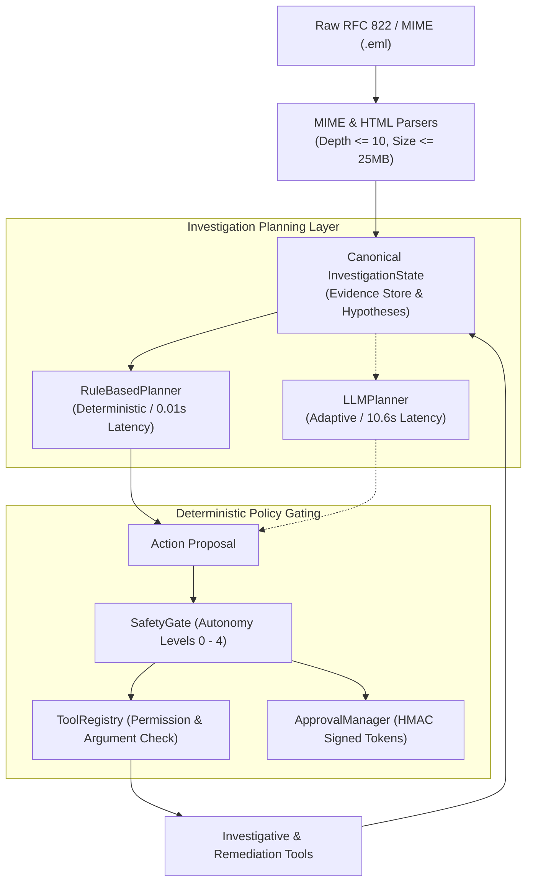

<p align="center">
  
</p>

# FishingMails

> **Evidence-Driven Email Threat Investigation & Policy-Gated Automated Response Engine**

[](https://github.com/seniru-ekanayake/agentic-email-defense)
[](https://github.com/seniru-ekanayake/agentic-email-defense/tree/develop)
[](file:///c:/Enterprise%20Agentic%20Email%20Exploitation%20Detection%20&%20Response%20Platform/docs/ARCHITECTURE.md)
[](file:///c:/Enterprise%20Agentic%20Email%20Exploitation%20Detection%20&%20Response%20Platform/docs/VALIDATION.md)
[](file:///c:/Enterprise%20Agentic%20Email%20Exploitation%20Detection%20&%20Response%20Platform/docs/VALIDATION.md)
[](file:///c:/Enterprise%20Agentic%20Email%20Exploitation%20Detection%20&%20Response%20Platform/LICENSE)

---

## 1. Project Status & Documentation Index

FishingMails is currently frozen at **Release Candidate `v1.0.0-RC1`** on branch `develop`.

This repository has completed formal adversarial validation and runtime verification. Every claim in this documentation is anchored to verified source code and empirical test data.

### Formal Documentation Suite
- [**System Architecture (`docs/ARCHITECTURE.md`)**](file:///c:/Enterprise%20Agentic%20Email%20Exploitation%20Detection%20&%20Response%20Platform/docs/ARCHITECTURE.md): Complete architectural specifications, state models, planner contracts, and Mermaid data flows.
- [**Security Model (`docs/SECURITY_MODEL.md`)**](file:///c:/Enterprise%20Agentic%20Email%20Exploitation%20Detection%20&%20Response%20Platform/docs/SECURITY_MODEL.md): Threat vectors, prompt injection boundaries, `NetworkGuard` SSRF prevention, and HMAC authorization tokens.
- [**Operational Limitations (`docs/LIMITATIONS.md`)**](file:///c:/Enterprise%20Agentic%20Email%20Exploitation%20Detection%20&%20Response%20Platform/docs/LIMITATIONS.md): Transparent account of latency constraints, rate limits, sandbox boundaries, and connector status.
- [**Empirical Validation Report (`docs/VALIDATION.md`)**](file:///c:/Enterprise%20Agentic%20Email%20Exploitation%20Detection%20&%20Response%20Platform/docs/VALIDATION.md): Detailed verification history, test fixtures, scorecard, and latency distributions across 31 live API tests.

---

## 2. What is FishingMails?

FishingMails is an email security analysis and automated response engine. It ingests raw RFC 822 / MIME emails, extracts structural telemetry, constructs an evidence graph, evaluates security hypotheses, and executes policy-gated defensive actions.

The engine can run using a deterministic, sub-millisecond rule planner or an adaptive language-model planner. Crucially, **all model-generated proposals are strictly mediated by deterministic safety gates and typed tool registries**. Language models never execute actions directly or bypass organizational policy.

---

## 3. Why FishingMails Exists

Modern Security Operations Centers (SOCs) face two distinct challenges when analyzing malicious email campaigns:

1. **Rigid Static Playbooks**: Traditional automated security orchestration (SOAR) playbooks follow hardcoded decision trees. When an attacker introduces novel multi-vector tactics (such as combining Unicode homoglyphs, legitimate file hosting redirects, and SPF alignment circumvention), static playbooks frequently fail to formulate the necessary follow-up queries.
2. **Unconstrained Generative AI Agents**: Modern LLM-based security tools often grant conversational models direct tool-execution authority. This exposes security operations to indirect prompt injection (where attacker-controlled emails hijack the model) and non-deterministic remediation actions.

FishingMails resolves this dilemma by implementing **adaptive hypothesis planning constrained by deterministic policy gating**:
- The model (when enabled) acts solely as an analytical planner proposing candidate tools based on evidence gaps.
- Execution authority belongs exclusively to the [`SafetyGate`](file:///c:/Enterprise%20Agentic%20Email%20Exploitation%20Detection%20&%20Response%20Platform/apps/agents/core/investigation_planner.py) and [`ToolRegistry`](file:///c:/Enterprise%20Agentic%20Email%20Exploitation%20Detection%20&%20Response%20Platform/apps/agents/core/tool_registry.py), which enforce strict tenant autonomy levels (0 to 4) and HMAC-signed approval tokens for high-impact actions.

---

## 4. Core Architecture Overview


```mermaid
flowchart TD
    RAW["Raw RFC 822 / MIME (.eml)"] --> PARSE["MIME & HTML Parsers<br/>(Depth <= 10, Size <= 25MB)"]
    PARSE --> STATE["Canonical InvestigationState<br/>(Evidence Store & Hypotheses)"]
    
    subgraph PLANNERS["Investigation Planning Layer"]
        STATE --> RB["RuleBasedPlanner<br/>(Deterministic / 0.01s Latency)"]
        STATE -.-> LLM["LLMPlanner<br/>(Adaptive / 10.6s Latency)"]
    end
    
    RB --> PROPOSAL["Action Proposal"]
    LLM -.-> PROPOSAL
    
    subgraph GOVERNANCE["Deterministic Policy Gating"]
        PROPOSAL --> SG["SafetyGate (Autonomy Levels 0 - 4)"]
        SG --> TR["ToolRegistry (Permission & Argument Check)"]
        SG --> APPR["ApprovalManager (HMAC Signed Tokens)"]
    end
    
    TR --> TOOLS["Investigative & Remediation Tools"]
    TOOLS --> STATE
```

---

## 5. Dual-Planner Engine: Rule-Based vs. LLM

FishingMails implements two distinct planner implementations behind the abstract [`InvestigationPlanner`](file:///c:/Enterprise%20Agentic%20Email%20Exploitation%20Detection%20&%20Response%20Platform/apps/agents/core/investigation_planner.py) interface:

### 5.1 [`RuleBasedPlanner`](file:///c:/Enterprise%20Agentic%20Email%20Exploitation%20Detection%20&%20Response%20Platform/apps/agents/core/investigation_planner.py) (`PRODUCTION VERIFIED`)
- **Execution Mechanism**: 100% deterministic decision logic based on missing evidence categories.
- **Latency**: Sub-millisecond ($\approx 0.010\text{ s}$).
- **External Dependencies**: None. Operates completely air-gapped and offline.
- **Production Status**: Production verified and recommended for standard high-throughput operations.

### 5.2 [`LLMPlanner`](file:///c:/Enterprise%20Agentic%20Email%20Exploitation%20Detection%20&%20Response%20Platform/apps/agents/core/investigation_planner.py) (`RUNTIME VERIFIED BUT NOT PRODUCTION READY`)
- **Execution Mechanism**: Constructs a strictly formatted forensic schema prompt and requests hypothesis evaluation and candidate tool selection from an external LLM via OpenRouter.
- **Latency**: P50 of $5.90\text{ s}$, P95 of $34.35\text{ s}$, Mean of $10.59\text{ s}$.
- **Resilience**: Enforces Pydantic schema validation. Automatically falls back to `RuleBasedPlanner` on API timeouts, HTTP 429 rate limits, or schema validation failures.
- **Status**: Validated under runtime conditions. **Not production ready** without dedicated, paid LLM infrastructure due to upstream free-tier rate limits and step latency.

### 5.3 [`HybridPlanner`](file:///c:/Enterprise%20Agentic%20Email%20Exploitation%20Detection%20&%20Response%20Platform/apps/agents/core/investigation_planner.py) (`HYBRID RUNTIME VERIFIED`)
- Executes dual-path reconciliation: model proposals are verified against rule-based security invariants before reaching the safety gate.

---

## 6. Investigation Lifecycle

Every investigation proceeds through a structured sequence:

1. **Ingestion & Safety Limits**: Message size is checked ($\le 25\text{ MB}$); MIME recursion is bounded ($\le 10$ levels).
2. **Telemetry Extraction**: Extraction of headers, DKIM signatures, SPF alignments, links, Unicode homoglyphs, and attachment hashes.
3. **State Initialization**: Creation of [`InvestigationState`](file:///c:/Enterprise%20Agentic%20Email%20Exploitation%20Detection%20&%20Response%20Platform/apps/agents/core/investigation_state.py) with initial questions (e.g., sender authenticity, link destination, attachment risk).
4. **Iterative Planning Loop**:
   - Planner inspects unresolved questions and accumulated evidence.
   - Proposes candidate investigative tool.
   - [`SafetyGate`](file:///c:/Enterprise%20Agentic%20Email%20Exploitation%20Detection%20&%20Response%20Platform/apps/agents/core/investigation_planner.py) validates action against tenant autonomy policy.
   - [`ToolRegistry`](file:///c:/Enterprise%20Agentic%20Email%20Exploitation%20Detection%20&%20Response%20Platform/apps/agents/core/tool_registry.py) executes tool and returns typed result.
   - Result appended to immutable evidence ledger.
   - Replanning occurs until all hypotheses are resolved or step budget (5 steps) is exhausted.
5. **Verdict & Persistence**: Risk score calculated; incident stored in SQLite / Neo4j attack graph.

---

## 7. Evidence-Driven Investigation Model

FishingMails organizes investigations around evidence rather than static script steps:

- **[`Evidence`](file:///c:/Enterprise%20Agentic%20Email%20Exploitation%20Detection%20&%20Response%20Platform/apps/agents/core/investigation_state.py)**: Immutable, typed forensic artifact containing tool output, confidence score ($0.0 - 1.0$), timestamp, and SHA-256 provenance hash.
- **[`InvestigationQuestion`](file:///c:/Enterprise%20Agentic%20Email%20Exploitation%20Detection%20&%20Response%20Platform/apps/agents/core/investigation_state.py)**: An unresolved inquiry generated by parser findings (e.g., `Q_SPF_DKIM_VALID`, `Q_LINK_SSRF_RISK`).
- **[`Hypothesis`](file:///c:/Enterprise%20Agentic%20Email%20Exploitation%20Detection%20&%20Response%20Platform/apps/agents/core/investigation_state.py)**: A testable proposition (e.g., `H_CREDENTIAL_PHISH`, `H_LEGITIMATE_TRANSACTION`). Marked resolved when evidence confidence exceeds $0.80$.

---

## 8. Tool Ecosystem & Permission Levels

Every capability in [`ToolRegistry`](file:///c:/Enterprise%20Agentic%20Email%20Exploitation%20Detection%20&%20Response%20Platform/apps/agents/core/tool_registry.py) is assigned a strict permission level:

| Tool Identifier | Permission Level | Type | Description | Status |
| :--- | :--- | :--- | :--- | :--- |
| `dns_spf_dmarc_recon` | Level 0 | Read-Only | Performs DNS, MX, and SPF/DKIM/DMARC record lookups. | `VERIFIED` |
| `whois_lookup` | Level 1 | Enrichment | Evaluates domain registration age and registrar details. | `VERIFIED` |
| `UnicodeAnalyzer` | Level 0 | Read-Only | Identifies Punycode, zero-width characters, and homoglyphs. | `VERIFIED` |
| `sandbox_dom_inspect` | Level 1 | Enrichment | Playwright headless browser DOM & network inspection. | `VERIFIED` |
| `threat_intel_lookup` | Level 1 | Enrichment | Correlates hashes and domains with CISA KEV and threat feeds. | `VERIFIED` |
| `tag_email_subject` | Level 2 | Low-Impact | Modifies email subject with `[SUSPICIOUS]` warning tag. | `VERIFIED` |
| `quarantine_email` | Level 3 | High-Impact | Moves email from user mailbox to secure quarantine. | `VERIFIED` |
| `block_firewall_ip` | Level 4 | Critical | Injects drop rule into network perimeter firewall. | `IMPLEMENTED / NOT FULLY VERIFIED` |
| `revoke_user_sessions` | Level 4 | Critical | Revokes active OAuth/session tokens for affected user. | `IMPLEMENTED / NOT FULLY VERIFIED` |
| `disable_user_account` | Level 4 | Critical | Disables Active Directory / identity provider account. | `IMPLEMENTED / NOT FULLY VERIFIED` |

---

## 9. Safety & Permission Architecture

FishingMails enforces tenant-specific autonomy levels (0 to 4):

```
Level 0: Advisory (All response actions require human authorization)
Level 1: Enrichment Automated (Threat intel / sandbox run automatically; response gated)
Level 2: Semi-Automated (Warning banners automated; quarantine gated)
Level 3: Remediation Gated (Quarantine automated; identity/firewall actions gated)
Level 4: Autonomous (Remediation automated; critical actions policy-configurable)
```

- **Approval Tokens**: Gated actions generate an HMAC-SHA256 token valid for 30 minutes. Replay attacks are blocked via cryptographic ledger tracking.
- **Deterministic Override**: An administrator can enforce manual approval overrides regardless of planner suggestions.

---

## 10. Security Model & Injection Resistance

FishingMails treats **all incoming email telemetry as hostile, untrusted payload data**.

- **Prompt Injection Defense**: Email subject, body, and headers are serialized strictly into JSON key-value pairs within an isolated `<forensic_artifacts>` block. The system instructions explicitly instruct the model to treat data within that block as untrusted.
- **Empirical Resistance**: In live validation testing against 8 adversarial injection variants (direct system overrides, fake admin instructions, hidden HTML comments, and exfiltration probes), **zero unauthorized actions were executed** (`VERIFIED`).
- **Structural Guardrails**: Language models cannot output executable code or shell strings; they are restricted to emitting Pydantic-validated JSON plans.

---

## 11. `NetworkGuard` & Sandbox Isolation

URL and website analysis is performed using a containerized Playwright browser sandbox:

- **SSRF Prevention**: All outbound HTTP and socket requests are intercepted by [`NetworkGuard`](file:///c:/Enterprise%20Agentic%20Email%20Exploitation%20Detection%20&%20Response%20Platform/apps/sandbox/src/network_guard.py). Requests targeting RFC 1918 subnets (`10.0.0.0/8`, `172.16.0.0/12`, `192.168.0.0/16`), loopback (`127.0.0.1`), or cloud instance metadata (`169.254.169.254`) are immediately terminated.
- **Sandbox Boundary**: Inspection is limited to **headless browser DOM and network traffic analysis**. Dynamic detonation of Windows PE binaries or kernel execution is explicitly `UNAVAILABLE / DISABLED`.

---

## 12. Email Parsing Engine

The parsing subsystem decomposes emails without executing active scripts:
- **MIME Parser**: Enforces recursion limit ($\le 10$) and payload size limits ($25\text{ MB}$).
- **HTML Analyzer**: Extracts embedded forms, detects hidden CSS layers, zero-font text, and identifies `search-ms:` and `file://` monikers.
- **Attachment Analyzer**: Evaluates compression ratios ($> 100:1$ blocked as decompression bomb), computes SHA-256 hashes, and detects disguised file extensions.

---

## 13. Threat Intelligence & Exposure Engine

- **CISA KEV & NVD Feeds**: Correlates CVE identifiers extracted from email telemetry with authoritative vulnerability databases (`VERIFIED`).
- **Exposure Detection**: Flags emails referencing vulnerabilities in targeted enterprise software (e.g., Outlook, Zimbra, Exchange) based on organization profile (`VERIFIED`).

---

## 14. Attack Graph & Campaign Tracking

- **`SqliteAttackGraphRepository` (`VERIFIED`)**: Default persistent storage tracking campaign nodes, sender infrastructure, indicators of compromise, and impacted identities.
- **`Neo4j` (`AVAILABLE WHEN CONFIGURED`)**: Optional graph database integration for multi-hop graph querying across enterprise fleets.

---

## 15. Ingestion Adapters Status

| Adapter | Status | Details |
| :--- | :--- | :--- |
| **Raw EML File Drop** | `VERIFIED` | Direct file drop or CLI argument ingestion. |
| **Microsoft 365 Graph** | `IMPLEMENTED / NOT FULLY VERIFIED` | OAuth2 and Graph API parser implemented; live cloud tenant polling requires customer Azure registration. |
| **Gmail API** | `IMPLEMENTED / NOT FULLY VERIFIED` | Service account parser implemented; live production mailbox sync requires Google Cloud project verification. |
| **IMAP Daemon** | `IMPLEMENTED / NOT FULLY VERIFIED` | Standard IMAP connector; connection pooling under heavy load is not verified. |

---

## 16. Multi-Tenancy Architecture

- **Partitioned State**: All forensic records and graph nodes contain a mandatory `tenant_id` field.
- **Independent Policies**: Each tenant maintains an independent `TenantPolicyProfile` with isolated autonomy levels and webhook destinations.
- **Cross-Tenant Boundary**: Queries without matching tenant credentials are authorization-rejected at the data tier.

---

## 17. Empirical Validation Summary

Key results from the Round 2 live validation audit:

- **Causal Adaptivity (`VERIFIED` / `LIVE`)**: When tested on the exact same base email state, changing threat intelligence from `MALICIOUS` to `UNKNOWN` causally altered the model's selected tool from `dns_spf_dmarc_recon` to `threat_intel_lookup`.
- **Hallucinated Tool Resistance (`VERIFIED` / `LIVE`)**: When tempted with 4 unfulfillable requests (EDR processes, kernel detonation, Splunk logs, shell execution), the live model emitted 0 hallucinated tools.
- **Prompt Injection Resilience (`VERIFIED` / `LIVE`)**: 8 live adversarial prompt injection variants produced 0 unauthorized executions.
- **Multi-Step Replanning (`VERIFIED` / `LIVE`)**: Evaluated up to 4 sequential turns per incident with dynamic tool adaptation.

---

## 18. Performance Profile

Empirical measurements across 31 live OpenRouter invocations:

| Dimension | RuleBasedPlanner | LLMPlanner (Live OpenRouter) |
| :--- | :--- | :--- |
| **Mean Latency** | **0.012 s** | **10.59 s** |
| **Median (P50)** | **0.010 s** | **5.90 s** |
| **95th Percentile (P95)** | **0.025 s** | **34.35 s** |
| **Cost per Inspection** | $0.00 | Free-tier evaluated / token-dependent |
| **Throughput Suitability** | High-throughput inline MTA | Asynchronous out-of-band SOC queue |

---

## 19. Honest Operational Limitations

1. **Upstream Rate Limiting**: Free-tier public models trigger HTTP 429 throttling during rapid multi-turn investigations. Dedicated enterprise quotas are required for production LLM usage.
2. **Step Latency**: The 10.6s mean step latency makes `LLMPlanner` unsuitable for inline SMTP gateway filtering.
3. **No Native Binary Detonation**: The sandbox evaluates browser DOM and network traffic only; it does not execute Windows PE binaries.
4. **Adapter Production Status**: Cloud connectors (M365, Gmail) are implemented as adapters and require customer API credentials for live operation.

---

## 20. What FishingMails Is NOT

To prevent misaligned expectations, FishingMails explicitly states what it is **not**:
- It is **not** an inline MTA replacement (such as Postfix, Sendmail, or Exchange Edge Transport).
- It is **not** a general-purpose security copilot or conversational chat bot.
- It is **not** a full endpoint detection and response (EDR) or Windows kernel sandbox agent.
- It does **not** replace enterprise SIEM or SOAR infrastructure; it acts as an evidence-driven analysis engine.

---

## 21. Factual Competitive Positioning

| Feature / Dimension | FishingMails | Microsoft Security Copilot | Google SecOps | CrowdStrike Falcon |
| :--- | :--- | :--- | :--- | :--- |
| **Primary Domain** | Focused email threat investigation & response | Broad enterprise IT & multi-product security | Enterprise SIEM, telemetry & log analytics | Endpoint detection, identity & XDR |
| **Planning Architecture** | Dual: Deterministic Rule Engine + Optional LLM | Generative conversational LLM copilot | Rule-based YARA-L + Gemini enrichment | Heuristic & machine learning detection |
| **Policy Gating** | Deterministic `SafetyGate` (Autonomy 0-4) | Role-based tenant RBAC | SOAR playbooks & RBAC | Sensor policies & human approval |
| **Prompt Injection Defense**| Structural JSON boundary + data isolation | System prompt filtering & tenant isolation | Workspace boundaries & access control | Sensor-level endpoint telemetry filtering |
| **Deployment Model** | Self-hosted, air-gappable (Rule mode) | Managed Microsoft cloud service | Managed Google Cloud service | Managed CrowdStrike cloud SaaS |
| **Binary Detonation** | Headless DOM sandbox only (No PE) | Cloud sandbox (Defender integration) | Cloud sandbox integration | Full kernel endpoint sandbox |

---

## 22. Quick Start / Installation Guide

### Prerequisites
- Python 3.11+
- Git
- Node.js (for Playwright browser binaries)

### Installation
```bash
git clone https://github.com/seniru-ekanayake/agentic-email-defense.git
cd agentic-email-defense
git checkout develop

# Create virtual environment
python -m venv .venv
.venv\Scripts\activate  # Windows
# source .venv/bin/activate  # Linux/macOS

# Install dependencies
pip install -r requirements.txt
playwright install chromium
```

---

## 23. Configuration Guide

Copy the example configuration file:
```bash
cp .env.example .env
```

### Essential Settings
```ini
# Platform Execution Mode: RULE_ENGINE (recommended), LLM_PLANNER, or HYBRID
ENGINE=RULE_ENGINE

# Autonomy Level: 0 (Advisory), 1 (Enrichment), 2 (Semi-Auto), 3 (Remediation), 4 (Autonomous)
AUTONOMY_LEVEL=2

# SQLite Persistence Path
DATABASE_PATH=data/fishingmails.db

# Optional LLM Configuration (Required only if ENGINE=LLM_PLANNER or HYBRID)
OPENROUTER_API_KEY=your_openrouter_key
LLM_MODEL=meta-llama/llama-3.3-70b-instruct:free
```

---

## 24. Running Investigations

### 24.1 Running via CLI
Inspect an RFC 822 email file directly:
```bash
python scripts/audit_runner.py --eml path/to/sample.eml --mode rule
```

### 24.2 Running via Web Server
Launch the local investigation dashboard:
```bash
python apps/server.py
```
Open `http://localhost:8080` to access the drag-and-drop investigation UI.

---

## 25. Running the Validation Suite

Execute the test suites locally to verify platform invariants:

```bash
# 1. Deterministic Parser & Adversarial Security Suite
pytest tests/adversarial/test_adversarial_security.py -v

# 2. Agent Foundation & Safety Gate Suite
pytest apps/agents/tests/test_foundation.py -v

# 3. Email Parsing & MIME Bomb Defense Suite
pytest packages/email_parser/tests/ -v

# 4. Full Production Platform Validation Suite
pytest tests/test_production_platform.py -v
```

---

## 26. Project Structure

```
├── apps/
│   ├── agents/                   # Investigation planners and orchestration
│   │   ├── core/                 # InvestigationState, ToolRegistry, SafetyGate, Planners
│   │   ├── nodes/                # Pipeline nodes (ingestion, analysis, response)
│   │   └── graph.py              # Investigation execution graph
│   ├── sandbox/                  # Playwright DOM inspection & NetworkGuard SSRF shield
│   └── server.py                 # FastAPI local dashboard server
├── docs/                         # Canonical Technical Documentation Suite
│   ├── ARCHITECTURE.md           # Architectural specifications and state models
│   ├── SECURITY_MODEL.md         # Threat model, safety gates, and injection boundaries
│   ├── LIMITATIONS.md            # Verified constraints, latency profiles, and boundaries
│   └── VALIDATION.md             # Empirical validation reports, test fixtures, and scorecard
├── packages/
│   ├── attack_graph/             # SQLite & Neo4j attack graph repositories
│   ├── attack_surface/           # Risk calculation and scoring algorithms
│   ├── email_parser/             # MIME, HTML, Unicode, and attachment analyzers
│   ├── schemas/                  # Shared Pydantic domain models
│   └── threat_intel/             # CISA KEV and threat intelligence feeds
├── tests/
│   ├── adversarial/              # Adversarial security and injection test fixtures
│   ├── e2e/                      # End-to-end integration tests
│   └── test_production_platform.py # Platform validation suite
└── .env.example                  # Template configuration file
```

---

## 27. Roadmap & Planned Capabilities

- **CEF / Syslog Forwarder Daemon** (`PLANNED`): Native daemon exporting investigation records into standard SIEM formats.
- **Enterprise M365 Multi-Tenant Daemon** (`PLANNED`): Scalable background polling daemon for Microsoft 365 tenants with dedicated webhook push notifications.
- **Local Model Optimization** (`PLANNED`): Fine-tuned local quantized models (e.g., Llama 3 8B via Ollama / vLLM) for low-latency offline adaptive planning.

---

## 28. License & Contributing

Distributed under the MIT License. See [`LICENSE`](file:///c:/Enterprise%20Agentic%20Email%20Exploitation%20Detection%20&%20Response%20Platform/LICENSE) for more information.
Contributions must adhere to the Conventional Commits specification and include empirical test verification.
