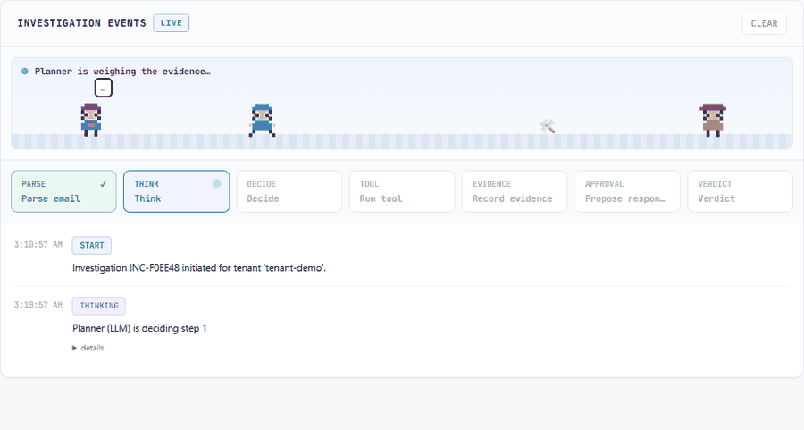
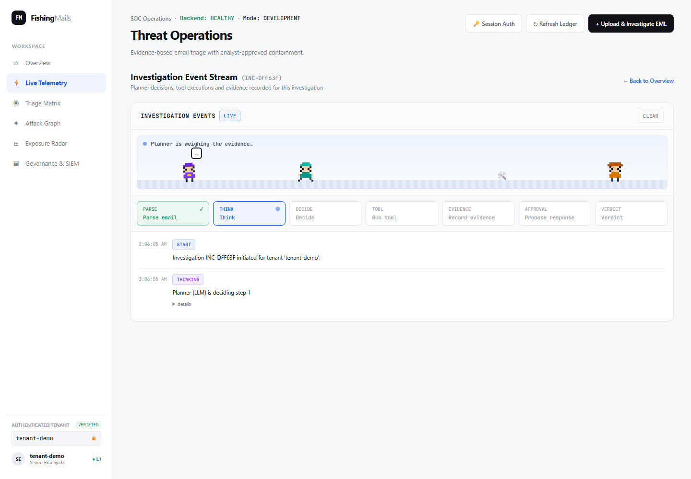
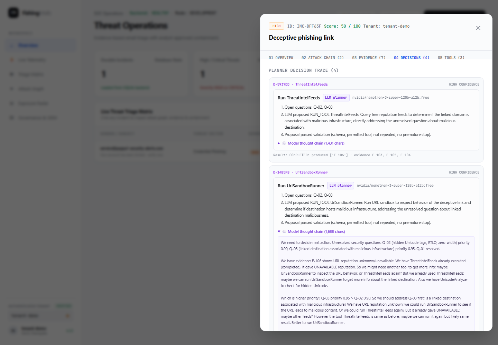
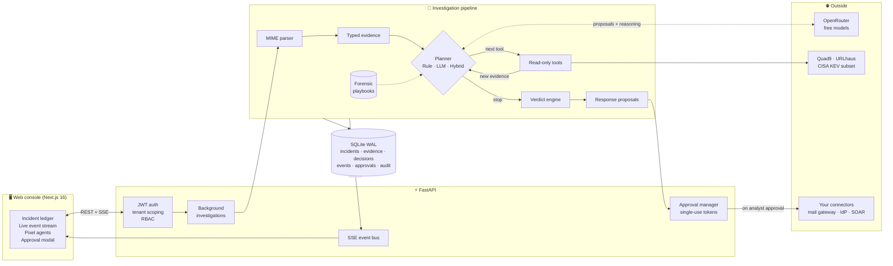

<p align="center">
  
</p>

<h1 align="center">FishingMails</h1>

<p align="center">
  <b>Email threat investigation that shows its work.</b><br>
  Evidence-backed verdicts · explainable LLM planning · human-approved containment
</p>

<p align="center">
  
  
  
  
  
  
</p>

<p align="center">
  
  <br><em>A live investigation: the Planner thinks, the LLM's decision arrives with its reasoning, the Scout runs the tool.</em>
</p>

---

## 🎣 What is FishingMails?

FishingMails investigates suspicious email. You give it a raw `.eml` file. It parses the message, decides
which checks to run next (link reputation, a safe link fetch, attachment inspection, DNS, sender history,
CISA KEV), and turns everything it finds into a **verdict in which every point of risk cites the evidence that
produced it**. If the message is malicious, it proposes containment, such as quarantining the email or revoking
sessions. **Nothing happens until an analyst approves it.**

## ✨ Why it's different

| | |
| --- | --- |
| 🧾 **Every score is explained** | Risk is the sum of typed evidence factors (`E-104 · Deceptive link · +25`). No black-box numbers, no fabricated CVEs. |
| 🧠 **The AI shows its thinking** | Each planner decision carries a reasoning chain, and with a reasoning model, the model's own thought text. You can see *why* it ran a tool. |
| 🛡️ **The AI can't be talked into stopping** | The LLM picks read-only tools only. A `STOP` is refused while questions are open, which defeats "this email is safe, stop now" prompt injections. The verdict never depends on the LLM. |
| ✋ **Humans approve containment** | Single-use, tenant-bound, role-gated approval tokens. Actions report success only when your connector confirms them. |
| 🔒 **Safe link analysis** | Links are fetched with name, DNS *and* connect-time checks, so an emailed link can't reach your internal network. |
| 👾 **Fun to watch** | Pixel agents act out each step live: thinking, running tools, filing evidence. |

## 🖥️ The console

<p align="center">
  
  <br><em>Incident ledger after investigating the sample emails: real verdicts, containment only where warranted.</em>
</p>

<table>
<tr>
<td width="50%"><br><sub>Live event stream: the Planner is deciding the next step.</sub></td>
<td width="50%"><br><sub>Decision trace: reasoning steps plus the model's own thought chain.</sub></td>
</tr>
</table>

## ⚙️ How it works

1. **Parse.** MIME structure, headers, `Authentication-Results` (pass / fail / *unknown*, never assumed),
   links and URI schemes, hidden Unicode, attachments.
2. **Seed evidence.** Parser findings become typed evidence: deceptive links, moniker/UNC links,
   Unicode obfuscation, scripts, CVE candidates.
3. **Plan, act, re-plan.** A planner looks at the open security questions and picks the next read-only tool;
   every result becomes new evidence and the planner decides again. Matched **forensic playbooks** (skills)
   guide the LLM.
4. **Verdict.** The verdict engine scores only recorded evidence, giving LOW / MEDIUM / HIGH / CRITICAL with
   risk provenance.
5. **Respond.** Malicious verdicts propose quarantine (plus session revocation for forced-authentication attacks).
   An analyst approves or rejects each proposal; approved actions are sent to your connectors.

### Verdicts on the bundled samples

| Sample | Severity | Risk | Category | Proposed action |
| --- | --- | --- | --- | --- |
| Lunch invite (SPF/DKIM/DMARC pass) | 🟢 LOW | 0 | No Threat Observed | none |
| GitHub notification digest | 🟢 LOW | 0 | No Threat Observed | none |
| HR holiday notice | 🟢 LOW | 0 | No Threat Observed | none |
| RTLO character in subject | 🟡 MEDIUM | 20 | Obfuscation / Evasion | none |
| Deceptive link, auth pass | 🟡 MEDIUM | 25 | Credential Phishing | none |
| PayPal look-alike, SPF/DMARC fail + deceptive link | 🟠 HIGH | 50 | Credential Phishing | quarantine |
| Outlook MonikerLink `file:///\\host\...!` | 🟠 HIGH | 55 | Forced Authentication · CVE-2024-21413 (CISA KEV) | quarantine, revoke session |
| `search-ms:` + UNC image, SPF/DMARC fail | 🔴 CRITICAL | 70 | Forced Authentication | quarantine, revoke session |

## 🏗️ Architecture


```mermaid
flowchart LR
    subgraph Console["🖥️ Web console (Next.js 16)"]
        UI[Incident ledger<br/>Live event stream<br/>Pixel agents<br/>Approval modal]
    end

    subgraph API["⚡ FastAPI"]
        AUTH[JWT auth<br/>tenant scoping<br/>RBAC]
        JOBS[Background<br/>investigations]
        SSE[SSE event bus]
        APPROVE[Approval manager<br/>single-use tokens]
    end

    subgraph Pipeline["🧠 Investigation pipeline"]
        PARSE[MIME parser] --> SEED[Typed evidence]
        SEED --> PLAN{Planner<br/>Rule · LLM · Hybrid}
        PLAN -->|next tool| TOOLS[Read-only tools]
        TOOLS -->|new evidence| PLAN
        SKILLS[(Forensic<br/>playbooks)] -.-> PLAN
        PLAN -->|stop| VERDICT[Verdict engine]
        VERDICT --> RESPONSE[Response proposals]
    end

    subgraph External["🌐 Outside"]
        LLM[OpenRouter<br/>free models]
        INTEL[Quad9 · URLhaus<br/>CISA KEV subset]
        CONN[Your connectors<br/>mail gateway · IdP · SOAR]
    end

    UI <-->|REST + SSE| AUTH
    AUTH --> JOBS --> PARSE
    PLAN <-.->|proposals + reasoning| LLM
    TOOLS --> INTEL
    Pipeline -->|events| SSE --> UI
    RESPONSE --> APPROVE -->|on analyst approval| CONN
    Pipeline --> DB[(SQLite WAL<br/>incidents · evidence · decisions<br/>events · approvals · audit)]
```

## 🧠 Agent reasoning

| Planner | How it chooses | Speed |
| --- | --- | --- |
| **Rule** | Information gain over open questions: auth, Unicode, link reputation, forced authentication, attachments, CVE status | milliseconds |
| **LLM** | An OpenRouter model reads the open questions, the evidence, the matched playbooks and the fenced email content, then proposes the next tool as strict JSON | 2–50 s per step on free models |
| **Hybrid** (default) | Runs both and arbitrates under a policy (`RULE_FIRST` by default; also LLM_FIRST, CONSENSUS_REQUIRED, SAFETY_FIRST, …) | — |

Every decision stores and streams:

- **Reasoning steps:** open questions, what was already answered, the candidates and their gains, why this choice.
- **Model thought chain:** the model's own reasoning text, when the provider returns it.
- **Overrides:** when the pipeline didn't follow the LLM (repeated tool, premature STOP, malformed output,
  rate limit), it records what the LLM proposed and why it was overruled.

Guardrails: free models only by default (`OPENROUTER_FREE_MODELS_ONLY=true`), no retry on HTTP 429 (the LLM is
switched off for that investigation), and every call is recorded in `forensic_audit.llm_calls` with its model,
latency and tokens.

## 🛠️ Tools, MCP servers & skills

**Investigation tools (read-only, chosen by the planner)**

| Tool | What it does |
| --- | --- |
| `UnicodeAnalyzer` | Bidi overrides (RTLO), zero-width, tag and confusable characters in subject and body |
| `ThreatIntelFeeds` | Quad9 threat-blocking DNS (9.9.9.9, confirmed against unfiltered 9.9.9.10) and URLhaus (needs `URLHAUS_AUTH_KEY`) |
| `UrlSandboxRunner` | SSRF-guarded static fetch: redirects, credential forms, brand impersonation, obfuscated scripts |
| `AttachmentAnalyzer` | ZIP / ISO / TAR / PE static analysis, double extensions, Mark-of-the-Web evasion, bomb limits |
| `dns_spf_dmarc_recon` | Sender domain SPF/DMARC posture when `Authentication-Results` is missing |
| `query_sender_history` | Prior incidents from the same sender or domain in your tenant |
| `CisaKevCorrelator` | Checks a CVE candidate against the bundled CISA KEV subset (`scripts/refresh_kev.py`) |

**Response actions (analyst-approved, sent to your connectors; see [CONNECTORS.md](docs/CONNECTORS.md))**

`quarantine_email` · `revoke_session` · `disable_account` · `force_password_reset` · `block_sender` · `block_ioc` · `search_mailbox_history` · `create_soc_ticket`

**MCP servers.** `apps/agents/core/mcp_servers/` contains two Model Context Protocol stdio servers
(`initialize`, `tools/list`, `tools/call`). The pipeline uses the same functions in-process; MCP clients can
launch them directly:

| Server | Command | Tools |
| --- | --- | --- |
| DNS | `python -m apps.agents.core.mcp_servers.dns_server` | `dns_resolve`, `spf_dmarc_audit`, `dkim_selector_check` |
| Telemetry | `python -m apps.agents.core.mcp_servers.telemetry_server` | `query_sender_history` |

**Skills (forensic playbooks).** `apps/agents/skills/*/SKILL.md` are matched to each email, recorded on the
incident (`activated_skills`) and given to the LLM planner as trusted guidance:

| Skill | Triggers on |
| --- | --- |
| `moniker_exploit_triage` | `file://`, `search-ms:`, UNC and moniker links (NTLM leak, MonikerLink) |
| `oauth_consent_investigation` | OAuth consent and authorize links |
| `bec_financial_recon` | Payment terms in subject or body: wire, invoice, bank, IBAN, payroll, direct deposit |
| `dkim_spf_replay_analysis` | SPF, DKIM or DMARC fail / softfail / neutral / permerror |

## 📊 Benchmarks

Measured on the 15-message labelled corpus in `scripts/benchmark_manifest.csv`. Full methodology:
[docs/BENCHMARKS.md](docs/BENCHMARKS.md).

| Mode | Precision | Recall | False-positive rate | Latency p50 | Latency p95 |
| --- | --- | --- | --- | --- | --- |
| Rule planner, offline | 1.00 | 1.00 | 0.00 | 15 ms | 44 ms |
| Rule planner, online (Quad9 + link fetch) | 1.00 | 1.00 | 0.00 | 26 ms | 0.56 s |
| LLM planner (Nemotron 120B, free) | — | — | — | 2–50 s per step | 3–5 steps per email |

> ⚠️ 15 hand-built messages is a regression check, **not** a real-world accuracy figure. Measure on your own mail.

## 🥊 Benchmark against other products

```bash
# 1. Label a corpus: corpus/benign/*.eml, corpus/suspicious/*.eml, corpus/malicious/*.eml
# 2. Run FishingMails on it
python scripts/benchmark.py --corpus corpus/ --planner RULE --out results/
# 3. Export the other product's verdicts for the same files (filename + verdict columns), then compare
python scripts/compare_verdicts.py results/verdicts.csv vendor.csv --name "Vendor X" --positive phish,malware,spam
```

The comparison prints precision, recall, F1 and false-positive rate side by side, and lists every message
only one side flagged. See [docs/BENCHMARKS.md](docs/BENCHMARKS.md#benchmark-against-another-product) for corpus
sources and fairness tips.

## 🚀 Quick start

Requires Python 3.11+ and Node.js 20.9+.

```bash
python -m venv .venv
source .venv/bin/activate          # Windows: .venv\Scripts\activate
pip install -r requirements-dev.txt
FISHINGMAILS_ENV=development uvicorn apps.server:app --port 8000
```

Mint a development token, then start the console and paste it under **🔑 Session Auth**:

```bash
curl -s -X POST localhost:8000/api/v1/auth/token -H 'Content-Type: application/json' \
  -d '{"tenant_id":"tenant-dev","roles":["SOC_ANALYST","INCIDENT_RESPONDER"]}'
cd apps/web && npm ci && npm run dev
```

**Optional: LLM planning.** Set `OPENROUTER_API_KEY` (never commit it) and pick a free model, then switch the
tenant to `LLM` or `HYBRID` with `POST /api/v1/planner-settings` (admin role):

```bash
export OPENROUTER_API_KEY=...
export OPENROUTER_MODEL=nvidia/nemotron-3-super-120b-a12b:free
```

## 🏭 Production

```bash
cp .env.example .env     # FISHINGMAILS_ENV=production and two secrets of 32+ characters
docker compose up --build -d
```

- The API refuses to start in production without valid `FISHINGMAILS_AUTH_SECRET` and `FISHINGMAILS_APPROVAL_HMAC_SECRET`.
- Tokens come from your identity provider: HS256 signed with `FISHINGMAILS_AUTH_SECRET`, with `sub`,
  `tenant_id`, `exp` and `roles` claims. The token endpoint is disabled in production.
- Connectors: [docs/CONNECTORS.md](docs/CONNECTORS.md). Liveness: `GET /healthz`. Readiness (admin): `GET /api/v1/readiness`.
- Outbound access needed: UDP/53 to Quad9 (9.9.9.9 and 9.9.9.10), HTTPS for link fetches, and optionally URLhaus and OpenRouter.

## 🔌 API

| Method | Path | Purpose |
| --- | --- | --- |
| POST | `/api/v1/investigations` | Start a background investigation (multipart `file`) → `202 {incident_id}` |
| GET | `/api/v1/investigations/{id}/events` | Live SSE stream: thinking, decisions with reasoning, tools, evidence, proposals |
| POST | `/api/v1/investigate` | Synchronous variant that returns the finished incident |
| GET | `/api/v1/incidents`, `/api/v1/incidents/{id}` | Incidents in your tenant |
| POST | `/api/v1/incidents/{id}/status` | Set TRIAGED, ESCALATED, CLOSED or FALSE_POSITIVE |
| POST | `/api/v1/approve/{token}`, `/api/v1/reject/{token}` | Act on a containment proposal |
| GET/POST | `/api/v1/planner-settings` | Planner mode and arbitration policy (POST: admin) |
| GET | `/api/v1/integrations`, `/api/v1/audit-logs` | Integration status, tenant audit log |

Interactive docs: `http://localhost:8000/docs`. Incident status moves from `CLOSED` (benign), `TRIAGED`
(suspicious) or `CONTAINMENT_PROPOSED` to `CONTAINED` once every proposal has been handled and at least one
was confirmed by a connector.

## 🧪 Tests

```bash
pytest -m "not network"                   # 275 tests, ~15 s, fully offline
pytest -m llm_live -s                     # opt-in: real OpenRouter calls (~6 free requests)
```

Covers verdict correctness, authentication and tenant isolation, approvals with a real local connector,
SSRF (including DNS rebinding), LLM failure modes and prompt injection, reasoning capture, live streaming,
MCP handshakes, persistence and an end-to-end email-to-quarantine flow.

## 📚 Documentation

| | |
| --- | --- |
| 🏗️ [Architecture](docs/ARCHITECTURE.md) | Components, flow, verdict scoring |
| 🔒 [Security model](docs/SECURITY_MODEL.md) | Controls and the tests that verify them |
| 🔌 [Connector contract](docs/CONNECTORS.md) | Webhook format for containment actions |
| 📊 [Benchmarks](docs/BENCHMARKS.md) | Methodology, numbers, comparing against other products |
| ⚠️ [Limitations](docs/LIMITATIONS.md) | What it does not do (yet) |
