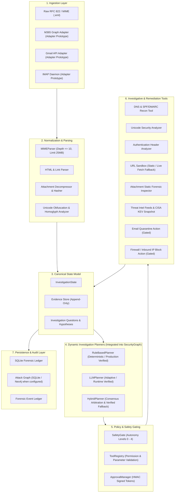
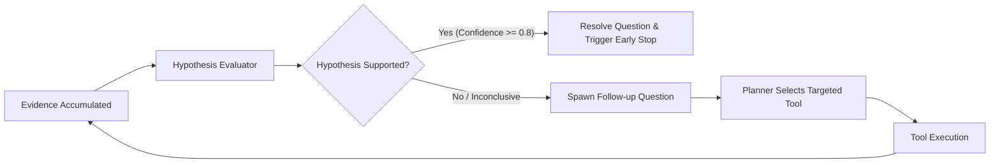
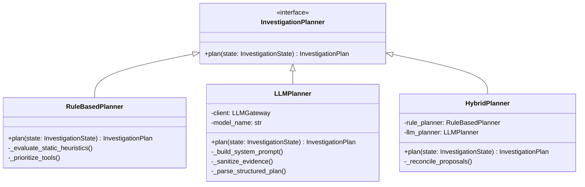
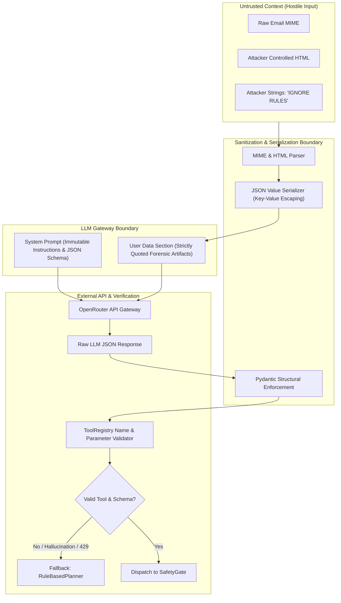

# FishingMails Architecture Specification

> **Platform Status:** `v1.0.0-RC1` (Release Candidate)  
> **Repository Branch:** `develop`  
> **Specification Version:** 1.0  
> **Last Updated:** 2026-10-01  

---

## 1. System Overview & Architectural Objectives

FishingMails is a specialized, evidence-driven email security analysis and automated response platform. It accepts raw RFC 822 / MIME emails and related security telemetry, constructs a typed forensic investigation state, evaluates evidence against security hypotheses, and executes policy-gated defensive actions.

### Core Architectural Invariants

1. **Strict Separation of Telemetry and Control Flow**: Incoming email content (headers, body, HTML, attachments) is classified as hostile, untrusted payload data. Telemetry is never executed directly, injected raw into shell contexts, or passed unescaped to language models.
2. **Deterministic Safety Gating**: Language models (when enabled) are constrained to proposing hypotheses and candidate investigative actions. Execution authority is strictly mediated by a deterministic `SafetyGate` and `ToolRegistry` enforcing tenant autonomy policies.
3. **Evidence Append-Only Provenance**: Evidence items collected during an investigation are immutable, cryptographically hash-identified, and tracked with confidence scores and acquisition timestamps.
4. **Resilient Degradation**: The system is fully operational without an external LLM. If the external LLM provider experiences latency, rate limiting (HTTP 429), or structural failures, the architecture falls back deterministically to the local `RuleBasedPlanner`.

---

## 2. High-Level Architecture

The platform consists of seven distinct layers:



---

## 3. End-to-End Data Flow

The lifecycle of an email through FishingMails follows a deterministic, closed-loop state-machine:

1. **Ingestion & Size Check**: The raw email payload is ingested. The stream reader validates payload size limits (maximum 25 MB).
2. **MIME & Structural Parsing**: The payload is unpacked by `MIMEParser`. Headers are extracted into canonical structures. Multipart structures are parsed with recursion depth restricted to $\le 10$ levels to prevent decompression bombs.
3. **Lexical & Obfuscation Analysis**:
   - `HTMLAnalyzer` strips active scripts, extracts embedded links, identifies zero-font text, CSS hidden layers, and search-ms monikers.
   - `UnicodeAnalyzer` evaluates Punycode, Cyrillic/Latin homoglyphs, and zero-width spaces.
   - `AttachmentAnalyzer` calculates SHA-256 hashes, inspects MIME-magic types, and flags double extensions (e.g., `.pdf.exe`).
4. **Initial State Initialization**: A canonical `InvestigationState` is generated with an immutable `investigation_id` and initial raw evidence.
5. **Question Formulation**: `InvestigationQuestion` objects are instantiated based on observed signals (e.g., "Is the sender domain spoofed?", "Does the embedded URL host credential harvesting forms?").
6. **Plan Generation**: The active planner (`RuleBasedPlanner`, `LLMPlanner`, or `HybridPlanner`) inspects the current evidence collection and unanswered questions to emit a proposed `InvestigationPlan` containing prioritized candidate actions.
7. **Safety Gate Evaluation**: Each candidate action is passed to `SafetyGate.validate_action()`. The action's registered severity level is matched against the tenant's configured autonomy level. If human authorization is required, an HMAC-signed approval request is registered and execution pauses.
8. **Tool Execution**: Authorized actions are executed by `ToolRegistry`. Network-bound tools (e.g., sandbox rendering) are strictly bound to `NetworkGuard` policies.
9. **Evidence Append**: Tool execution results are structured as typed `Evidence` objects and appended to the `InvestigationState`.
10. **Replanning Loop**: The investigation loop evaluates if unanswered questions remain and whether the maximum step budget (default: 5 iterations) has been reached. If high-confidence conclusive evidence is found (e.g., domain confirmed malicious or clean), early termination occurs.
11. **Response Generation & Audit Write**: A final `ForensicReport` is generated. All state transitions, tool invocations, and cryptographic evidence hashes are persisted to the forensic ledger.

---

## 4. Canonical State Model (`InvestigationState`)

Investigation state is tracked using a strongly typed model defined in `apps/agents/core/investigation_state.py`.

### State Fields and Types

```python
class InvestigationState(BaseModel):
    investigation_id: str
    tenant_id: str = "default_tenant"
    email_id: str
    raw_email_path: Optional[str] = None
    created_at: datetime
    updated_at: datetime
    
    # Forensic Evidence & Hypotheses
    evidence: List[Evidence] = Field(default_factory=list)
    questions: List[InvestigationQuestion] = Field(default_factory=list)
    hypotheses: List[Hypothesis] = Field(default_factory=list)
    
    # Execution Tracking
    current_step: int = 0
    max_steps: int = 5
    executed_tools: List[Dict[str, Any]] = Field(default_factory=list)
    pending_approvals: List[str] = Field(default_factory=list)
    status: InvestigationStatus = InvestigationStatus.INITIALIZED
    
    # Risk & Scoring
    risk_score: float = 0.0
    confidence_score: float = 0.0
    verdict: Optional[str] = None
```

### Invariant Guarantees
- **Immutability of Historical Evidence**: Existing entries in `evidence` cannot be overwritten or deleted. New observations are strictly appended.
- **Monotonic Step Counter**: `current_step` increments strictly by 1 upon each planner turn, enforcing a hard upper limit of `max_steps` to guarantee cycle termination.
- **Tenant Scope Enforcement**: `tenant_id` is validated on all tool queries and state mutations to preserve strict multi-tenant boundary isolation.

---

## 5. Evidence & Question Model

### 5.1 Evidence Structure
Every forensic observation produced by parsers or tools is wrapped in an `Evidence` structure:

```python
class Evidence(BaseModel):
    evidence_id: str                      # UUIDv4
    source_tool: str                      # Identifier of emitting tool
    evidence_type: str                    # E.g., "DNS_AUTH", "SANDBOX_DOM", "THREAT_INTEL"
    data: Dict[str, Any]                  # Structured key-value findings
    confidence: float                     # Range [0.0, 1.0]
    timestamp: datetime                   # ISO 8601 acquisition time
    provenance_hash: str                  # SHA-256 hash of (source_tool + json(data))
```

### 5.2 Questions and Hypotheses
Investigations are directed by hypothesis testing rather than linear script execution:
- **`InvestigationQuestion`**: Represents a specific unknown regarding the email's intent, origin, or infrastructure (e.g., `Q_AUTH_LEGITIMACY`, `Q_LINK_DESTINATION`, `Q_PAYLOAD_EXECUTION`).
- **`Hypothesis`**: A testable proposition with a likelihood score (e.g., `H_CREDENTIAL_PHISH`, `H_BEC_IMPERSONATION`, `H_LEGITIMATE_NEWSLETTER`).
- **Resolution**: A question is marked `RESOLVED` when appended evidence provides sufficient confidence ($\ge 0.80$) to confirm or refute the linked hypothesis.



---

## 6. Investigation Planner Architecture

FishingMails implements a formal pluggable planner interface (`InvestigationPlanner`) allowing three distinct execution modes:



### 6.1 `RuleBasedPlanner` (`VERIFIED`)
- **Nature**: 100% deterministic, zero LLM dependency.
- **Operation**: Evaluates unanswered `InvestigationQuestion` entries against fixed priority tables. Orders candidate tools based on missing evidence categories (Authentication $\to$ Domain Infrastructure $\to$ Link Sandboxing $\to$ Threat Intel Correlation).
- **Runtime Performance**: Sub-millisecond latency ($\approx 0.01\text{ s}$).
- **Status**: Production verified across all baseline and adversarial suites.

### 6.2 `LLMPlanner` (`RUNTIME VERIFIED BUT NOT PRODUCTION READY`)
- **Nature**: Adaptive reasoning model via OpenRouter API (tested with `meta-llama/llama-3.3-70b-instruct:free`, `mistralai/mistral-7b-instruct:free`).
- **Operation**: Formats current evidence, questions, and available tool descriptions into a strict JSON-schema prompt. Receives proposed next actions, hypotheses, and rationales.
- **Runtime Performance**: P50 latency 5.90s, P95 latency 34.35s (observed mean 10.59s). Subject to upstream API rate limits (HTTP 429).
- **Safety Invariant**: LLM output is parsed through strict Pydantic schemas. Tool proposals are validated against the `ToolRegistry`. Hallucinated tool names or malformed arguments are caught and rejected. On failure or rate-limit exhaustion, it triggers immediate fallback to `RuleBasedPlanner`.

### 6.3 `HybridPlanner` (`HYBRID RUNTIME VERIFIED`)
- **Nature**: Dual-path consensus.
- **Operation**: Queries `LLMPlanner` for adaptive hypotheses while concurrently running `RuleBasedPlanner`. The deterministic rule engine validates or filters LLM candidate tool selections before passing to the safety gate.

---

## 7. Tool Registry & Safety Architecture

The `ToolRegistry` enforces strict governance over what actions the system can perform:

```python
class ToolCapability(BaseModel):
    name: str
    description: str
    permission_level: int                 # 0: Read-Only, 1: External Enrichment, 2: Low-Impact, 3: High-Impact, 4: Critical
    requires_approval: bool
    parameter_schema: Type[BaseModel]
    timeout_seconds: int = 30
```

### Permission & Autonomy Matrix

| Autonomy Level | Read-Only Tools (Level 0-1) | Low-Impact (Level 2) | High-Impact (Level 3) | Critical Actions (Level 4) |
| :--- | :--- | :--- | :--- | :--- |
| **Level 0 (Advisory)** | Automated Execution | Human Approval Req | Human Approval Req | Human Approval Req |
| **Level 1 (Enrichment)**| Automated Execution | Human Approval Req | Human Approval Req | Human Approval Req |
| **Level 2 (Semi-Auto)** | Automated Execution | Automated Execution | Human Approval Req | Human Approval Req |
| **Level 3 (Remediation)**| Automated Execution | Automated Execution | Automated Execution | Human Approval Req |
| **Level 4 (Autonomous)** | Automated Execution | Automated Execution | Automated Execution | Automated Execution (Tenant Explicit) |

- **Read-Only / Enrichment Tools (0-1)**: `dns_lookup`, `whois_lookup`, `spf_dkim_verify`, `threat_intel_query`, `sandbox_dom_inspect`.
- **Low-Impact Tools (2)**: `tag_email_subject`, `apply_mailbox_banner`.
- **High-Impact Tools (3)**: `quarantine_email`, `delete_inbox_copy`.
- **Critical Actions (4)**: `block_firewall_ip`, `revoke_user_sessions`, `disable_user_account`.

---

## 8. LLM Security Boundary & Isolation

Incoming untrusted email content is strictly segregated from model control logic:



---

## 9. Persistence & Storage Architecture

1. **State Persistence**: State is serialized into `data/fishingmails.db` via `SqliteAttackGraphRepository` and durable JSON ledgers.
2. **Forensic Audit Log**: Every tool invocation records:
   - Tool name and invocation arguments.
   - Return status code and standard output summary.
   - Elapsed execution time in milliseconds.
   - Actor identity (`planner:rule_based`, `planner:llm`, or `user:<admin_id>`).
3. **Graph Storage**:
   - `SQLite` (`VERIFIED`): Default relational store managing campaigns, email nodes, domain indicators, and observed CVEs.
   - `Neo4j` (`AVAILABLE WHEN CONFIGURED`): Optional graph persistence enabled via `NEO4J_URI` for complex multi-hop campaign clustering.

---

## 10. Multi-Tenancy & Data Isolation

- **Partitioning**: All database records and cache keys are prefixed with `tenant_id`.
- **Policy Scopes**: Each tenant maintains an independent `TenantPolicyProfile` defining autonomy level (0-4), allowed outbound enrichment providers, and notification webhooks.
- **Zero Cross-Contamination**: Tool executions operate strictly within the context of the active tenant's credentials and storage partition.
